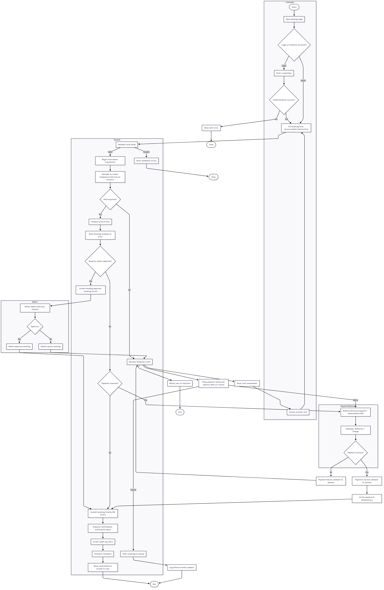

# requirement-analysis
# Requirement Analysis in Software Development

## Introduction
This repository serves as a structured documentation of the Requirement Analysis phase for a Booking Management System. 
The purpose of this repository is to provide a clear foundation for software development by documenting, analyzing, and organizing both functional and non-functional requirements, use cases, and acceptance criteria. 
It also includes visual representations of system interactions using diagrams to ensure clarity and alignment with business and user needs.

## What is Requirement Analysis?

Requirement Analysis is the process of systematically identifying, documenting, and evaluating the needs and expectations of stakeholders for a software system. It serves as a bridge between the client’s vision and the development team’s implementation, ensuring that the final product aligns with business objectives and user requirements.

### Importance in the Software Development Lifecycle (SDLC)
Requirement Analysis is a critical phase in the SDLC because it:

1. **Defines Clear Objectives:** Establishes what the system must achieve, reducing ambiguity and misunderstandings between stakeholders and developers.
2. **Identifies Functional Requirements:** Specifies the features and functions the system must provide to meet user needs.
3. **Determines Non-Functional Requirements:** Captures quality attributes such as performance, reliability, scalability, and security.
4. **Minimizes Project Risks:** Detects potential issues, gaps, or conflicts early, preventing costly revisions during later stages.
5. **Supports Effective Planning:** Provides a solid foundation for designing, developing, testing, and deploying the system.
6. **Ensures Stakeholder Alignment:** Confirms that all stakeholders have a shared understanding of system requirements, leading to higher satisfaction.

In summary, Requirement Analysis is the cornerstone of successful software development. By thoroughly analyzing and documenting requirements, development teams can build systems that effectively meet business goals, provide value to users, and reduce the risk of project failure.

## Why is Requirement Analysis Important?

Requirement Analysis plays a crucial role in the success of any software development project. Its significance in the SDLC can be highlighted through the following key reasons:

1. **Reduces Misunderstandings and Errors**  
   By clearly defining what the system should do, Requirement Analysis minimizes ambiguity between stakeholders and developers. This helps prevent costly errors and rework later in the development process.

2. **Facilitates Effective Planning and Resource Allocation**  
   Well-documented requirements allow project managers and development teams to estimate effort, time, and resources more accurately. This leads to better scheduling, budgeting, and allocation of team members.

3. **Ensures Stakeholder Satisfaction**  
   By capturing both functional and non-functional requirements, Requirement Analysis ensures that the final system meets user expectations and business goals. This alignment reduces the risk of dissatisfaction or project failure.

4. **Supports Quality Assurance**  
   Clear requirements provide a benchmark for testing and validation, making it easier to measure whether the system behaves as intended and meets quality standards.

In essence, Requirement Analysis is the foundation of a successful SDLC, ensuring clarity, efficiency, and stakeholder alignment throughout the software development journey.

## Key Activities in Requirement Analysis

Requirement Analysis involves several structured activities to ensure that all stakeholder needs are accurately captured, documented, and validated. The key activities include:

- **Requirement Gathering**  
  Collecting information from stakeholders, business documents, and existing systems to understand the overall objectives and constraints of the software project.

- **Requirement Elicitation**  
  Engaging with stakeholders through interviews, surveys, workshops, or observations to extract detailed functional and non-functional requirements.

- **Requirement Documentation**  
  Organizing and recording all gathered requirements in a clear, structured, and understandable format, often using requirement specification documents or user stories.

- **Requirement Analysis and Modeling**  
  Examining requirements for completeness, consistency, and feasibility. Creating visual models such as use case diagrams, flowcharts, or entity-relationship diagrams to better represent system behavior and interactions.

- **Requirement Validation**  
  Reviewing and verifying requirements with stakeholders to ensure they accurately reflect business needs, are achievable, and meet quality standards before proceeding to the design phase.

  ## Types of Requirements

Requirements in software development can be broadly classified into **Functional Requirements** and **Non-Functional Requirements**. Both types are essential to ensure the system meets user needs and quality standards.

### Functional Requirements
Functional requirements describe the specific behaviors, features, and functions that the system must provide to meet user needs. They define *what the system should do*.

**Examples for the Booking Management System:**
- Users must be able to create, view, update, and cancel bookings.
- The system should send email notifications to users after booking confirmation or cancellation.
- Admins should be able to manage available services, pricing, and schedules.
- Users can search for available slots based on date, time, and service type.
- Payment processing must be integrated to accept credit/debit cards and online payment methods.

### Non-Functional Requirements
Non-functional requirements define the quality attributes, constraints, and performance criteria of the system. They describe *how the system should behave* rather than specific features.

**Examples for the Booking Management System:**
- **Performance:** The system should load booking pages within 3 seconds.
- **Reliability:** The system must be available 99.9% of the time.
- **Security:** User data must be encrypted, and access to admin features should be role-based.
- **Usability:** The interface should be intuitive and easy for users with minimal training.
- **Scalability:** The system should support up to 10,000 concurrent users without performance degradation.

## Use Case Diagrams

### What is a Use Case Diagram?
A Use Case Diagram is a visual representation of the interactions between **actors** (users or external systems) and the system itself. It helps in understanding the functional requirements of a system by illustrating **who does what** and the relationships between actors and use cases.

**Benefits of Use Case Diagrams:**
- Provides a clear and concise overview of system functionality.
- Helps communicate requirements to stakeholders effectively.
- Serves as a foundation for writing detailed use cases and system design.
- Identifies all interactions between users and the system to avoid missing features.

### Use Case Diagram for Booking Management System

The key actors and use cases in the booking system are:

**Actors:**
- User (Customer)
- Admin
- Payment Gateway

**Use Cases:**
- Create Booking
- View Booking
- Update Booking
- Cancel Booking
- Manage Services & Schedule (Admin)
- Process Payment
- Send Notifications

Below is the use case diagram illustrating the interactions:

### Acceptance Criteria for Key Features

| Feature                     | Acceptance Criteria                                                                                  |
|------------------------------|-----------------------------------------------------------------------------------------------------|
| **Checkout**                 | - Users can select a booking and proceed to payment. - System accepts valid payment methods. - Confirmation message is displayed after payment. - Booking status updates to "Confirmed". - Email receipt sent within 5 minutes. - Payment failures show clear error messages. |
| **Booking Management**       | - Users can create, view, update, and cancel bookings. - Users receive confirmation notifications. - System prevents double booking for the same slot. - Admins can view all bookings and manage schedules. |
| **User Authentication**      | - Users can register and log in securely. - Passwords are stored securely using encryption. - Role-based access control is enforced. - Users can reset forgotten passwords via email. |
| **Notifications**            | - System sends email or SMS notifications for booking creation, updates, and cancellations. - Notifications are delivered within 5 minutes of the event. - Users can opt in or out of notifications. |
| **Payment Processing**       | - Payment gateway integration works for multiple payment methods. - Failed payments trigger retry messages. - Transaction history is recorded for each user. - System ensures PCI compliance for payment data. |

